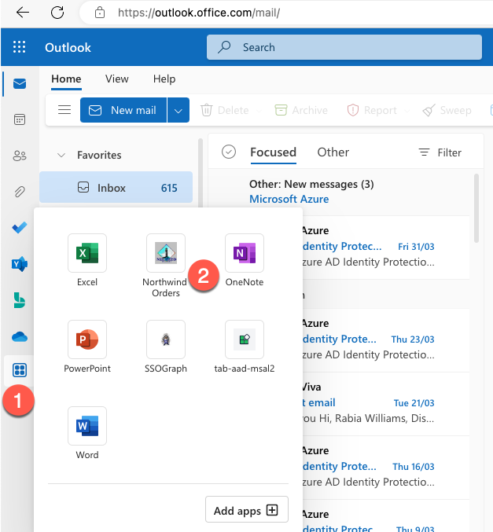
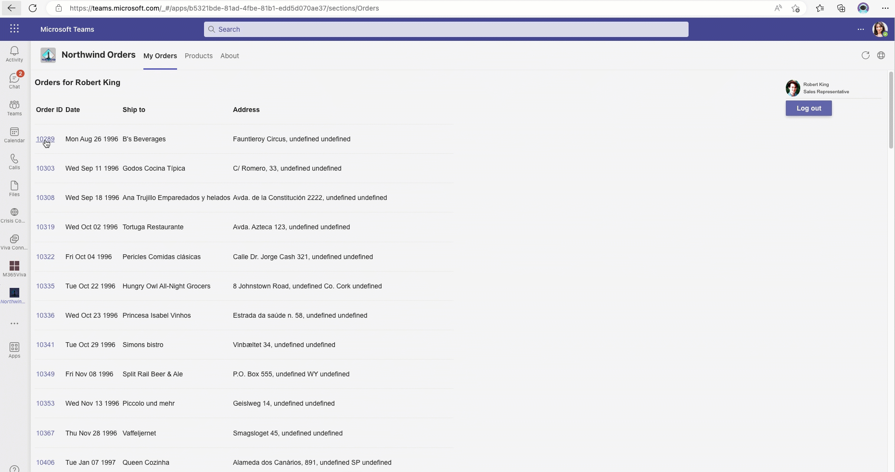
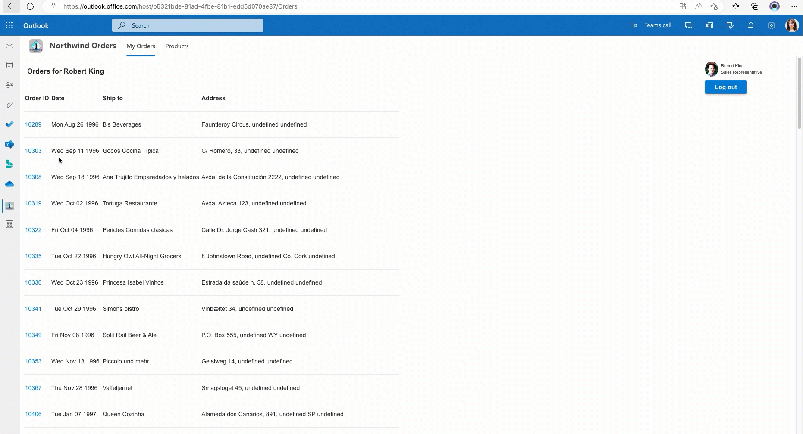

---8<--- "heading.md"

# Extend your Teams app to Outlook and Microsoft365 app

---8<--- "extended-lab-intro.md"

With the release of the Teams app manifest 1.13 or latest, you can now run your teams apps in other Microsoft 365 products like Outlook and Microsoft 365 app (previously known as Office app).
In this lab, you'll extend the personal tab app which is the core application, to other products in the Microsoft 365. We will also leverage Microsoft Teams JavaScript client library to integrate native capabilities of these products in our application like chat, mail etc.


We will cover the following concepts in this exercise:

[Extend Teams apps across Microsoft 365](https://learn.microsoft.com/en-us/microsoftteams/platform/m365-apps/overview)
[Teams JavaScript client library](https://learn.microsoft.com/en-us/microsoftteams/platform/tabs/how-to/using-teams-client-library?tabs=javascript%2Cmanifest-teams-toolkit)

### Features
- Extend Teams app to Outlook and Microsoft 365 app
- Add Chat capability in order details when the app is running in Teams
- Add Mail capability in order details when the app is running in Outlook.

### Exercise 1: Upgrade manifest & Teams JS Client library package version

#### Step 1: Upgrade manifest

To make your core application work in multiple host apps like Outlook or Microsoft 365 app, you have to upgrade the manifest version of the app package. To do that, go to the root of your core application, and find the file **manifest.template.json** in the folder named `/manifest`. You will need to update `schema` and `manifestVersion` in order to make this work.

Change from
```json
  "$schema": "https://developer.microsoft.com/en-us/json-schemas/teams/v1.12/MicrosoftTeams.schema.json",
  "manifestVersion": "1.12",
```
to 
```json
  "$schema": "https://developer.microsoft.com/json-schemas/teams/v1.16/MicrosoftTeams.schema.json",
  "manifestVersion": "1.16",
```
#### Step 2: Update the Teams client library references
You'll need to update your Teams JS client library package to `@microsoft/teams-js@2.0.0` (or higher).

You can skip this step in this lab,as we are using version `2.0.0` of the library in our existing core applicaton.

> This is already done for you in appcamp, if you check the CDN import statements in appcamp's core project you will see it references version `2.0.0`.
```javascript
import 'https://res.cdn.office.net/teams-js/2.0.0/js/MicrosoftTeams.min.js';
```

### Exercise 2: Run the application in Outlook and Microsoft 365 app.

Your Teams app is now compatible with Outlook and Microsoft 365 app. Package the app and start the application locally to test.
You'll need to follow some additonal steps to test the app.

#### Step 1: Update the Azure AD app registration for SSO

- Go to [Azure AD admin portal](https://aad.portal.azure.com/) and make sure you're logged in as the administrator of your development tenant. Click "Azure Active Directory" 1️⃣ and then "App Registrations" 2️⃣.

- Select the name of your personal tab application which is your core applicaton, to open its app registration.

- Select "Expose an API" 1️⃣ and then "+ Add a client application" 2️⃣.
- In the section for Authorized client applications, make sure that you have added Client Id values for all of the following:

Microsoft 365client application|	Client ID|
---|---|
Teams desktop, mobile|	1fec8e78-bce4-4aaf-ab1b-5451cc387264|
Teams web |	5e3ce6c0-2b1f-4285-8d4b-75ee78787346|
Microsoft 365 web|	4765445b-32c6-49b0-83e6-1d93765276ca|
Microsoft 365 desktop|	0ec893e0-5785-4de6-99da-4ed124e5296c|
Microsoft 365 mobile|	d3590ed6-52b3-4102-aeff-aad2292ab01c|
Outlook desktop|	d3590ed6-52b3-4102-aeff-aad2292ab01c|
Outlook web|	bc59ab01-8403-45c6-8796-ac3ef710b3e3|
Outlook mobile|	27922004-5251-4030-b22d-91ecd9a37ea4|


#### Step 2: Package your application
Open a command line tool in your working folder and type

```
npm run package
```

This will generate a new manifest.json file and a new app package (northwind.zip).


#### Step 3: Run your app locally
In your working directory run this command to start the application
```
npm start
```

#### Step 4: Upload your app package

Here are the steps you can follow to upload your app package to the unified store via the Microsoft 365 admin center:

- Go to the [Microsoft 365 admin center](https://admin.microsoft.com/adminportal/home#/homepage)
- Expand **Settings** from the left navigation menu.
- Select **Integrated apps** which will take you to the page where you can manage your application.
- Select **Upload custom apps** which will then ask you to upload the app package.
- Choose **App type** *Teams app* and upload the zip file. On proceeding next you will see the host products where your app will be deployed to like Microsoft 365, Outlook and Teams, select **Next**
- It will then ask for target users to test the app whether it should be avialable to just the user uploading or entire org or specific set of users, Select **Entire organization** for this lab.
- Accept any permission requests in the next page.
- Finally review and select **Finish Deployment**. Your app is now ready to be tested in multiple host products in Microsoft 365.

This should ensure that your app is available across multiple products within Microsoft 365.

#### Step 5: Test your app in different areas of Microsoft 365.

#### Teams web

- To see your app in Teams, go to **Apps** in the left menu.
- Find **Northwind Orders** in the **Built for your org** app catalog since the app is already deployed and installed for the entire organization.
- **Open** the app.


##### Outlook web
To see your app in [Outlook on the web](https://outlook.office.com/), follow these instructions:

1. Sign in using your dev tenant account on Outlook.

2. Look for the More Apps option within the side bar. You should see your **Northwind Order**, including the sideloaded app title.

3. Click on the app icon to preview and launch the app, and see it running in Outlook on the web.



##### Microsoft 365 web
To see your app running in Microsoft 365 on the web, follow these steps:

1. Log in to [microsoft365.com](microsoft365.com) with your account.

2. Look for the **Apps** icon on the side bar. Your **Northwind Orders** app should be visible among your installed apps.

3. Click on the app icon to launch your app and run it in Microsoft 365 on the web.


> Another thing you can do is test the apps on Teams client, Outlook on Windows or any other available platforms, but for the sake of keeping this process simple and easy to understand, we will proceed without these additional tests.

### Exercise 3: Add addtional capabilities to the app

Having your app appear in multiple areas of Microsoft 365 is not just to broaden the reach of your app, but also to allow it to run more relevant and contextual functionalities in each of its host apps.

The library provides context information like host name in which it is running like Teams or Outlook so you can theme your app better.

The APIs in the SDK are grouped into different capabilities that are supported by the host apps. For example, chat, dialog, and page are different capabilities. Each capability has its own namespaces that can be used to invoke them. The capabilities of the host apps can be integrated into the app through their associated APIs. You can use the `<the-capability>.isSupported()` function for each capability to determine if it is supported by the host app where the app is running before invoking it. Checking whether the capabilities are supported by the host apps helps ensure that only the supported capabilities are used by the app, providing a more relevant app experience for users.

#### Step 1: Add new theme files

Remove files northwind.css and teamstyle.css from the `client` folder.
Create a new folder `styles` and copy the files from this folder into your newly created `styles` folder.


#### Step 2: Add code to load themes based on host app

Now lt's use the Teams JS library to better understand the environment in which our app is running.

Go to the file `teamsHelpers.js` under the folder `client/modules` and update the function `inTeams()` replacing it with the below function.

```javascript
// async function returns true/false if we're running in M365
export async function inM365() {
  try {
      await ensureTeamsSdkInitialized();
      return true;     
  }
  catch (e) {
      console.log(`${e} from Teams SDK, may be running outside of M365`);
      return false; 
  }
}
```

After the function `setTheme()`, replace every code with below code snippet.

```javascript
const setHostAppTheme=(fileName)=> {
  let element = document.createElement("link");
  element.setAttribute("rel", "stylesheet");
  element.setAttribute("type", "text/css");
  element.setAttribute("href", fileName);
  document.getElementsByTagName("head")[0].appendChild(element);
}  
// Inline code to set theme on any page using teamsHelpers
(async () => {
  await ensureTeamsSdkInitialized();
  if(await inM365()) {
    const context= await microsoftTeams.app.getContext();  
    if(context) {
      setTheme(context.theme);     
      switch(context.app.host.name){
        case microsoftTeams.HostName.teams:{
          setHostAppTheme("../styles/northwind.css");           
        };        
        break;
        case microsoftTeams.HostName.outlook:{
          setHostAppTheme("../styles/northwind-outlook.css");
        };
          break;
        case microsoftTeams.HostName.office:{
          setHostAppTheme("../styles/northwind-office.css");
        }
        break;
        default:{ //any other hub for future
          setHostAppTheme("../styles/northwind.css");
        }
        // When the theme changes
         microsoftTeams.app.registerOnThemeChangeHandler((theme) => {
          setTheme(theme);
        });
      }    
    }  
}
else{
  setHostAppTheme("../styles/northwind.css"); // browser app
}
})();
```
#### Step 4: Update references to `inTeams()` function

Find and replace `inTeams()` references to `inM356()`in all files in the `src`folder.

#### Step 3: Add host native capabilities to your app

Now, let's begin by adding some native functionalities of the application in the host apps, starting with Teams chat and Outlook mail.

According to the functionality, an assumed contact will be used to initiate chat or mail. The assumed contact will come from an environment variable, which you can pass as an email ID of a user.

Let's first add this new environment variable `CONTACT`.
Go to the `server.js` file and udpate `app.get('/modules/env.js',` to add a new variable. Append below code after adding a comma to the last variable.

```
 CONTACT:  "${process.env.CONTACT}"
```

To add the contact information to the environment file, go to the `.env` file and add the contact information of a user's email id other than yourself in your tenant.

Now let's add the capabilities.
Go to the orderdetails.html file under the `client/pages` folder and add below code for a button element just after the `orderDetails` table.

```HTML
 <button id="ShowButton" type="submit">Show</button>
```
Now go to the `orderDetail.js` and import the env files by appending below code snippet with the top import statements.
```
import { env } from '../modules/env.js';

```

Now let's paste below code snippet for a new function `displayCallOrChat` just after the `displayUI` function.

```
async function displayCallOrChat() {
    const searchParams = new URLSearchParams(window.location.search);
    if (searchParams.has('orderId')) {
        const orderId = searchParams.get('orderId');
        const buttonElement = document.getElementById("ShowButton");
        if (await inM365()) {
            //chat support
            if (microsoftTeams.chat.isSupported()) {
                buttonElement.textContent = "Chat";
                buttonElement.addEventListener('click', async ev => {
                    await microsoftTeams.chat
                        .openChat({
                            user: [env.CONTACT],                           
                            message: `Hi, to discuss about ${orderId}`
                        });
                });

                //mail support
            } else if (microsoftTeams.mail.isSupported()) {
                buttonElement.textContent = "Mail";
                buttonElement.addEventListener('click', async ev => {
                    microsoftTeams.mail.composeMail({
                        type: microsoftTeams.mail.ComposeMailType.New,
                        subject: `Enquire about order ${orderId}`,
                        toRecipients: [env.CONTACT],
                        message: "Hello",
                    });
                });
            }else{
                buttonElement.style.display="none";
            }
        }
    }
}
```
Now go ahead and call this function ,place the function call `displayCallOrChat();` right after calling the `displayUI();` function call.

All code changes are complete now let's go ahead and test this application in Teams and Outlook.

#### Step 4: Test app capabilities

#### Chat in Teams

Open the app in Teams and go to an order. If chat is a supported capability in Teams, the chat button will be displayed to the user. Choose the button to open a 1:1 chat with the user you configured as the contact in the previous step.



#### Mail in Outlook

Open the app in Outlook web and go to an order. If Mail is a supported capability in Outlook, the Mail button will be displayed to the user. Choose the button to create a new outlook email with the user you configured as the contact in the previous step.



--8<-- "i-finished.md"

### Next steps

After completing this lab, you may continue with additional extended labs!


---8<--- "extended-lab-links.md"


