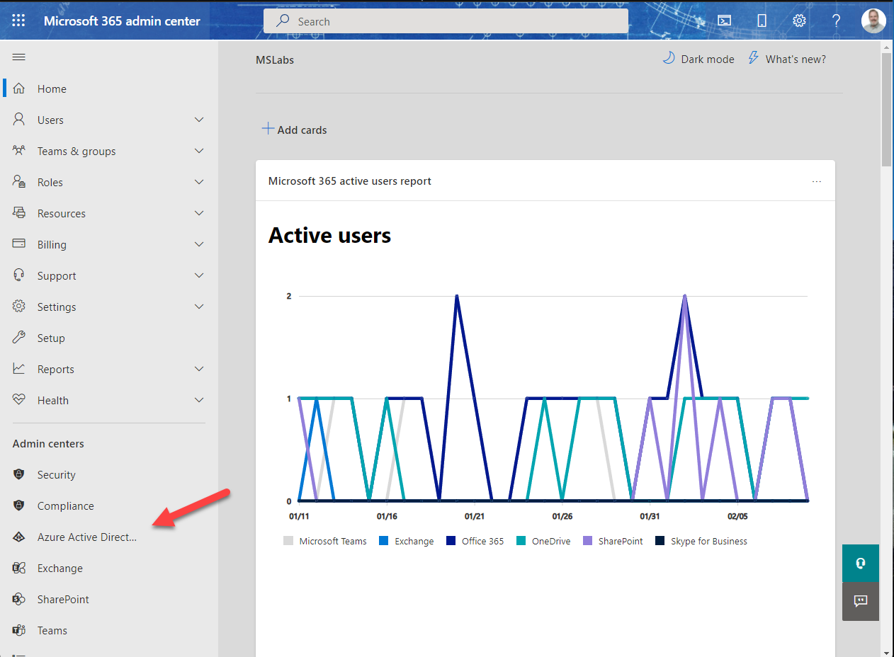
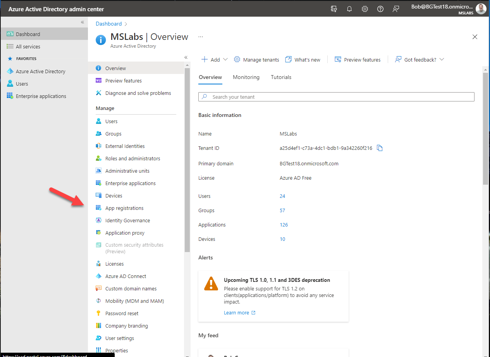
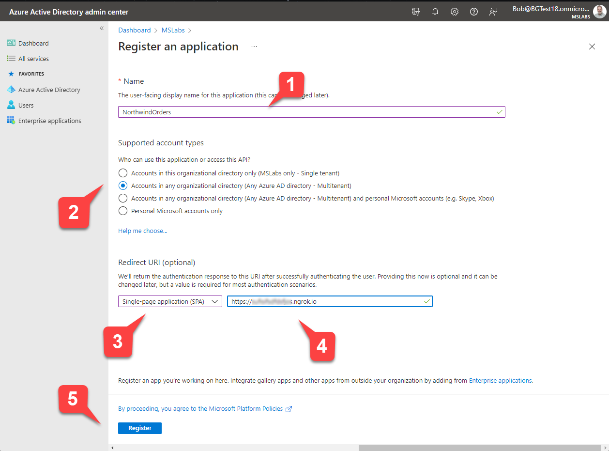
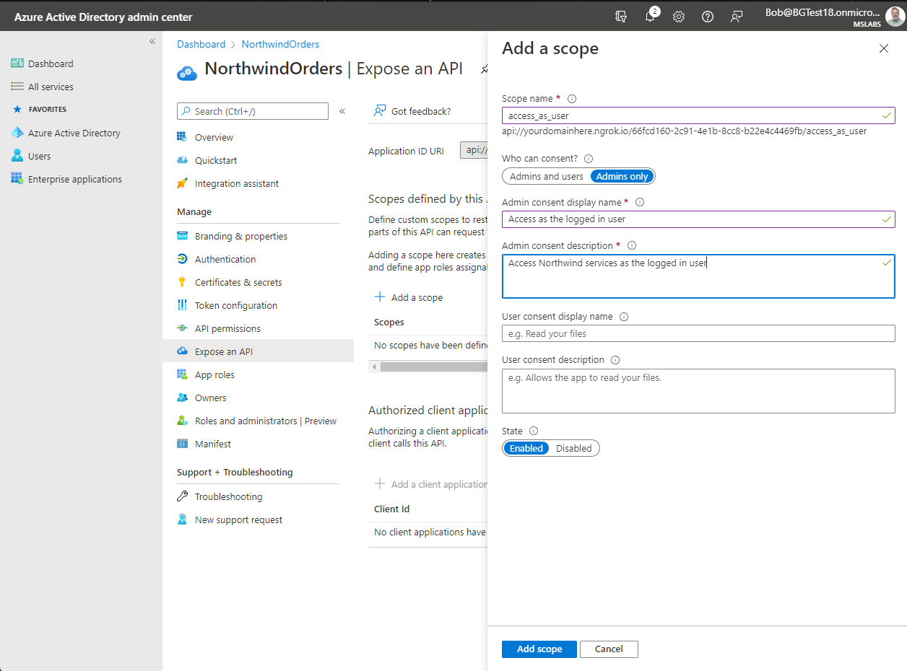

## Lab B03: Enable Azure AD Single Sign-On

This is parth of Path B, which begins with an application that uses an authorization system other than Azure AD.

---8<--- "are-you-on-the-right-path.md"

In this lab you will build the application you created in Lab B01 into a Microsoft Teams application. This application will still use the Northwind authentication, but since the Northwind login page won't work in the Teams tab IFrame, we'll use the Teams JavaScript SDK to show it in a pop-up.

Note that as you complete the labs, the original app should still work outside of Teams! This is often a requirement of ISV's who have an app in market and need to serve an existing customer base outside of Teams.

* [B01-begin-app: Setting up the application](./B01-begin-app.md) 
* [B02-after-teams-login: Creating a Teams application](./B02-after-teams-login.md)
* [B03-after-teams-sso: Adding Azure AD SSO to your app](./B03-after-teams-sso.md)(📍You are here)
* [B04-after-apply-styling: Teams styling and themes](./B04-after-apply-styling.md)

In this lab you will learn to:

- [Register an application with the Microsoft identity platform](https://docs.microsoft.com/en-us/azure/active-directory/develop/quickstart-register-app?WT.mc_id=m365-58890-cxa){target="_blank"}
- Configure ans Azure AD app registration to allow Teams to issue tokens on behalf of your application
- Use the Microsoft Teams JavaScript SDK to request an Azure AD access token
- How to validate an [Azure AD access token](https://docs.microsoft.com/en-us/azure/active-directory/develop/access-tokens?WT.mc_id=m365-58890-cxa){target="_blank"} in a NodeJS application

???+ info "Video briefing"
    

      </img>
      
"B Path" Lab Briefing

    

### Features

- Microsoft Teams personal tab application transparently logs the user in
- The first time a user accesses the application, it prompts them for their Northwind credentials and writes their Northwind employee ID into the user's profile in Azure AD
- After that, the application reads the employee ID from Azure AD to decide which orders to show

### Project structure

??? note "Project files before and after this lab (open to display ►)"
    The project structure when you start of this lab and end of this lab is as follows.
    Use this depiction for comparison.

    On your left is the contents of folder  `B02-after-teams-login` and on your right is the contents of folder `B03-after-teams-sso`.
    - 🆕 New files/folders

    - 🔺Files changed
    <table>
    <tr>
    <th >Project Structure Before </th>
    <th>Project Structure After</th>
    </tr>
    <tr>
    <td valign="top" >
    <pre>
    B02-after-teams-login
        ├── client
        │   ├── components
        │       ├── navigation.js
        │   └── identity
        │       ├── 🔺identityClient.js
        │       └── login.html
        │       └── 🔺login.js
        │       └── teamsLoginLauncher.html
        │       └── teamsLoginLauncher.js
        │       └── userPanel.js
        ├── modules
        │   └── env.js
        │   └── northwindDataService.js
        │   └── teamsHelpers.js
        ├── pages
        │   └── categories.html
        │   └── categories.js
        │   └── categoryDetails.html
        │   └── categoryDetails.js
        │   └── myOrders.html
        │   └── orderDetail.html
        │   └── orderDetail.js
        │   └── privacy.html
        │   └── productDetail.html
        │   └── productDetail.js
        │   └── termsofuse.html
        ├── index.html
        ├── index.js
        ├── northwind.css
        ├── manifest
        │   └── 🔺makePackage.js
        │   └── 🔺manifest.template.json
        │   └── northwind32.png
        │   └── northwind192.png
        ├── server
        │   └── constants.js
        │   └── 🔺identityService.js
        │   └── northwindDataService.js
        │   └── server.js
        ├── 🔺.env_Sample
        ├── .gitignore
        ├── 🔺package.json
        ├── README.md
    </pre>
    </td>
    <td>
    <pre>
    B03-after-teams-sso
        ├── client
        │   ├── components
        │       ├── navigation.js
        │   └── identity
        │       ├── 🆕aadLogin.html
        │       └── 🆕aadLogin.js
        │       ├── 🔺identityClient.js
        │       └── login.html
        │       └── 🔺login.js
        │       └── teamsLoginLauncher.html
        │       └── teamsLoginLauncher.js
        │       └── userPanel.js
        ├── modules
        │   └── env.js
        │   └── northwindDataService.js
        │   └── teamsHelpers.js
        ├── pages
        │   └── categories.html
        │   └── categories.js
        │   └── categoryDetails.html
        │   └── categoryDetails.js
        │   └── myOrders.html
        │   └── orderDetail.html
        │   └── orderDetail.js
        │   └── privacy.html
        │   └── productDetail.html
        │   └── productDetail.js
        │   └── termsofuse.html
        ├── index.html
        ├── index.js
        ├── northwind.css
        ├── manifest
        │   └── 🔺makePackage.js
        │   └── 🔺manifest.template.json
        │   └── northwind32.png
        │   └── northwind192.png
        ├── server
        │   └── constants.js
        │   └── 🔺identityService.js
        │   └── northwindDataService.js
        │   └── server.js
        ├── 🔺.env_Sample
        ├── .gitignore
        ├── 🔺package.json
        ├── README.md
    </pre>
    </td>
    </tr>
    </table>

### Exercise 1: Register your application with Azure AD

In order for users to log into your application with Azure AD, you need to register it. In this exercise you will register your application directly in the tenant you created in Lab B02, however we'll set it up so it can be used from other tenants, such as those of customers who purchase your application in the Microsoft Teams store.

???+ info "More information"
    

      <iframe src="//www.youtube.com/embed/RjGVOFm39j0" frameborder="0" allowfullscreen></iframe>
      
Learn about multi-tenant applications

    

#### Step 1: Register your application in Azure Active Directory

 - Navigate to the Microsoft 365 admin center at https://admin.microsoft.com/ and log in as the administrator of your developer tenant.

 - In the left navigation, click "Show More" to reveal the full list of admin centers, and then click "Azure Active Directory". This will bring you to the [Azure AD admin center](https://aad.portal.azure.com/){target="_blank"}.

- Click "Azure Active Directory" again in the left navigation bar.

- This will bring you to the overview of your Azure AD tenant. Note that a "tenant" is a single instance of Azure Active Directory, with its own users, groups, and app registrations. Verify that you're in the developer tenant you just created, and click "App Registrations" in the navigation bar.

- You will be shown a list of applications (if any) registered in the tenant. Click "+ New Registration" at the top to register a new application.

You will be presented with the "Register an application" form.

- Enter a name for your application 1️⃣.
- Under "Supported account types" select "Accounts in any organizational directory" 2️⃣. This will allow your application to be used in your customer's tenants.
- Under "Redirect URI", select "Single-page application (SPA)" 3️⃣ and enter the ngrok URL you saved earlier 4️⃣.
- Click the "Register" button 5️⃣

You will be presented with the application overview. There are two values on this screen you need to copy for use later on; those are the Application (client) ID 1️⃣ and the Directory (tenant) ID 2️⃣.

When you've recorded these values, navigate to "Certificates & secrets" 3️⃣.

Now you will create a client secret, which is like a password for your application to use when it needs to authenticate with Azure AD.

- Click "+ New client secret" 1️⃣
- Enter a description 2️⃣ and select an expiration date 3️⃣ for your secret 
- Click "Add" to add your secret. 4️⃣

The secret will be displayed just this once on the "Certificates and secrets" screen. Copy it now and store it in a safe place.

!!! warning "Managing app secrets is an ongoing responsibility"
    App secrets have a limited lifetime, and if they expire your application may stop working. You can have multiple secrets, so plan to roll them over as you would with a digital certificate.

!!! danger "Keep your secrets secret!"
    Give each developer a free developer tenant and register their apps in their tenants so each developer has his or her own app secrets. Limit who has access to app secrets for production. If you're running in Microsoft Azure, a great place to store your secrets is [Azure KeyVault](https://azure.microsoft.com/en-us/services/key-vault/){target="_blank"}. You could deploy an app just like this one and store sensitive application settings in Keyvault. See [this article](https://docs.microsoft.com/en-us/azure/app-service/app-service-key-vault-references?WT.mc_id=m365-58890-cxa){target="_blank"} for more information.

#### Step 2: Grant your application permission to call the Microsoft Graph API

The app registration created an identity for your application; now we need to give it permission to call the Microsoft Graph API. The Microsoft Graph is a RESTful API that allows you to access data in Azure AD and Microsoft 365, including Microsoft Teams.

- While still in the app registration, navigate to "API Permissions" 1️⃣. Notice that User.Read delegated permission for the Microsoft Graph API has automatically been placed on the list 2️⃣; this is exactly the permission we need to read the user's profile.

- The permission was added automatically, but nobody has consented to it 1️⃣. To fix this, click the "Grant admin consent for <tenant>" button and then agree to grant the consent 2️⃣. When this is complete, the message "Granted for <tenant>" should be displayed for each permission.

#### Step 3: Expose an API

The Northwind Orders app is a full stack application, with code running in the web browser and web server. The browser application accesses data by calling a web API on the server side. To allow this, we need to expose an API in our Azure AD application. This will allow the server to validate Azure AD access tokens from the web browser.

Click "Expose an API" 1️⃣ and then "Add a scope"2️⃣. Scopes expose an application's permissions; what you're doing here is adding a permission that your application's browser code can use it when calling the server. 

On the "Add a scope" flyout, edit the Application ID URI to include your ngrok URL between the "api://" and the client ID. Click the "Save and continue" button to proceed.

Now that you've defined the application URI, the "Add a scope" flyout will allow you to set up the new permission scope. Fill in the form as follows:
- Scope name: access_as_user
- Who can consent: Admins only
- Admin consent display name: Access as the logged in user
- Admin consent description: Access Northwind services as the logged in user
- (skip User consent fields)
- Ensure the State is set to "Enabled"
- Click "Add scope"

#### Step 4: Authorize Microsoft Teams to log users into your application

Microsoft Teams provides a Single Sign-On (SSO) capability so users are silently logged into your application using the same credentials they used to log into Microsoft Teams. This requires giving Microsoft Teams permission to issue Azure AD tokens on behalf of your application. In this step, you'll provide that permission.

Click "Expose an API" 1️⃣ and then "+ Add a client application" 2️⃣.

Paste the ID for the Teams mobile or desktop app, `1fec8e78-bce4-4aaf-ab1b-5451cc387264` into the flyout 1️⃣ and check the scope you created earlier 2️⃣ to allow Teams to issue tokens for that scope. Then click "Add application" 3️⃣ to save your work.

Repeat the process for the Teams web application, `5e3ce6c0-2b1f-4285-8d4b-75ee78787346`.

### Exercise 2: Update the Teams application package

You've given Microsoft Teams permission to issue an Azure AD access token to your application (single sign-on), but Microsoft Teams doesn't know about that. To provide the information Teams needs, we need to update the Teams Application package.

#### Step 1: Add the Azure AD information to the .env file

Open the .env file in your working directory and add these lines, filling in the information you saved during the app registration:

~~~text
TENANT_ID=00000000-0000-0000-0000-000000000000
CLIENT_ID=00000000-0000-0000-0000-000000000000
CLIENT_SECRET=xxxxx
~~~

#### Step 2: Add the Azure AD information to your manifest

In your working directory, edit the manifest/manifest.template.json file.

Update the revision number to a larger version number:

~~~json
  "version": "1.3.0",
~~~

Add a comma after the validDomains property and then add a new property, `webApplicationInfo`.

~~~json
  "webApplicationInfo": {
      "id": "<CLIENT_ID>",
      "resource": "api://<HOST_NAME>/<CLIENT_ID>"
  }
~~~

This provides the Azure AD app registration information to Microsoft Teams for use in the SSO process. The [finished manifest.template.json file is here](https://github.com/microsoft/app-camp/blob/main/src/create-core-app/bespoke/B03-after-teams-sso/manifest/manifest.template.json){target="_blank"} for your reference.

#### Step 3: Modify the packaging code to include the CLIENT_ID

Open the file manifest/makePackage.js in your code editor. Notice that the code only makes a few of the environment variables available when it creates manifest.json. We just added some references to `CLIENT_ID`, so we need to handle them in the makePackage.js code.

In the `if` statement where the code checks for the `TEAMS_APP_ID` and `HOST_NAME` environment variables, add the `CLIENT_ID` as well like this:

~~~javascript
    Object.keys(process.env).forEach((key) => {
        if (key.indexOf('TEAMS_APP_ID') === 0 ||
            key.indexOf('HOST_NAME') === 0 ||
            key.indexOf('CLIENT_ID') === 0) {
            data = data.split(`<${key}>`).join(process.env[key]);
            console.log (`Inserted ${key} value of ${process.env[key]}`);
        }
    });
~~~
#### Step 4: Rebuild the package

Now you can build a new package at any time with this command:

~~~shell
npm run package
~~~

Go ahead and run it, and two files, manifest.json and northwind.zip (the app package) should be updated in your manifest folder.

### Exercise 3: Update the application source code

#### Step 1: Update your package.json file

The updated code will use two new npm packages on the server side:

* @azure/msal-node: Allows login to Azure AD from your web server; this is needed when calling the Microsoft Graph API to read and write the user's employee ID.
* azure-ad-jwt: Validates an Azure AD access token sent by the client side code

To accommodate this, open the **package.json** file in your working directory and update the `dependencies` property to include these packages like this:

~~~json
  "dependencies": {
    "@azure/msal-node": "^1.5.0",
    "azure-ad-jwt": "^1.1.0",
    "cookie-parser": "^1.4.6",
    "dotenv": "^10.0.0",
    "express": "^4.17.1",
    "node-fetch": "^3.1.1",
    "request": "^2.88.0"
  },
~~~

Then, from a command line in your working directory, install the package by typing

~~~shell
npm install
~~~

#### Step 2: Add an identity mapping screen

When a user logs into the app for the first time, we will log them into _both_ Azure AD and the Northwind login scheme and save their Northwind employee ID in the Azure AD user profile. This is just one of many approaches; an application could save the Azure AD user ID and another system's user ID in a database, or it could save the Azure AD user ID in the user's profile within the other authentication. Any way you do it, the idea is to create a linkage between each Azure AD user and their user profile in the other identity service.

In this step, you'll add a new web page to handle this identity mapping. If the application reads the Azure AD user's employee ID and it's blank, the user will be redirected here.

In your working folder, create a file /client/identity/aadLogin.html and paste in this markup:

~~~html
<!doctype html>
<html>

<head>
    <meta charset="UTF-8" />
    <title>Northwind Login Page</title>
    <link rel="stylesheet" href="/northwind.css" />
    <link rel="icon" href="data:;base64,="> <!-- Suppress favicon error -->
</head>

<body>

    

        <h2>Northwind Login (AAD Mapping)</h2>
         
        
Please log in using your Northwind employee login it to link your Microsoft Teams login.

        <button id="teamsLoginLauncherButton">Log in</button>
    

    

    

</body>

</html>
~~~

Now create another file, /client/identity/aadLogin.js and insert this code:

~~~javascript
import 'https://res.cdn.office.net/teams-js/2.0.0/js/MicrosoftTeams.min.js';
import { ensureTeamsSdkInitialized } from '../modules/teamsHelpers.js';
import { setLoggedinEmployeeId } from './identityClient.js';

(async () => {

    const teamsLoginLauncher = document.getElementById('teamsLoginLauncher');
    const teamsLoginLauncherButton = document.getElementById('teamsLoginLauncherButton');

    await ensureTeamsSdkInitialized();
    const authToken = await microsoftTeams.authentication.getAuthToken();

    const response = await fetch(`/api/validateAadLogin`, {
        "method": "post",
        "headers": {
            "content-type": "application/json",
            "authorization": `Bearer ${authToken}`
        },
        "body": JSON.stringify({
            "employeeId": 0
        }),
        "cache": "no-cache"
    });
    if (response.ok) {
        const data = await response.json();
        if (data.employeeId) {
            // If here, AAD user was mapped to a Northwind employee ID
            setLoggedinEmployeeId(data.employeeId);
            window.location.href = document.referrer;
        }
    } else if (response.status === 404) {

        // If here, AAD user logged in but there was no mapping to an employee ID.
        // Get one now using the bespoke authentication
        teamsLoginLauncherButton.addEventListener('click', async ev => {

            // First, launch the original login page to get the user credentials
            const northwindCredentials = await
                microsoftTeams.authentication.authenticate({
                    url: `${window.location.origin}/identity/login.html?teams=true`,
                    width: 600,
                    height: 535
                });

            // Now call the server with BOTH the Azure AD and original credentials
            // Server is responsible for linking them in its database for next time
            const response = await fetch(`/api/validateAadLogin`, {
                "method": "post",
                "headers": {
                    "content-type": "application/json",
                    "authorization": `Bearer ${authToken}`
                },
                "body": JSON.stringify({
                    "username": northwindCredentials.username,
                    "password": northwindCredentials.password
                }),
                "cache": "no-cache"
            });

            // Now log the user in with the bespoke system
            setLoggedinEmployeeId(northwindCredentials.employeeId);
            window.location.href = document.referrer;
        });

        teamsLoginLauncher.style.display = "inline";

    } else {

        console.log(`Error ${response.status} on /api/validateAadLogin: ${response.statusText}`);

    }

})();
~~~

This code uses the Teams JavaScript SDK to obtain an Azure AD token using `microsoftTeams.authentication.getAuthToken()`, and then it calls the server side at /api/validateAadLogin using this token. The server will read the user's employeeId and return it. If the employee ID is not found, the server returns an HTTP 404 error and the code prompts the user to log in via the Northwind login page. When the user logs in, the code passes his or her credentials back to /api/validateAadLogin, which looks up the employeeId and writes it to the user's profile.

#### Step 3: Return the username and password from the login page

Open the file /client/identity/login.js in your code editor, and find the call to `notifySuccess()`. Modify it to return the username and password so the aadLogin.html page can provide it to the server.

~~~javascript
    microsoftTeams.authentication.notifySuccess({
        username: usernameInput.value,
        password: passwordInput.value,
        employeeId: employeeId
    });
~~~

The completed login script is [here at B03-after-teams-sso/client/identity/login.js](https://github.com/microsoft/app-camp/blob/main/src/create-core-app/bespoke/B03-after-teams-sso/client/identity/login.js){target="_blank"}

#### Step 4: Modify the logoff code

Logging off in this new version of the Teams app will be a very transitory thing, because the user will immediately be logged back on again! However we'll leave it in place for testing purposes.

Open the file client/identity/identityClient.js in your code editor and change the line:

~~~javascript
    window.location.href = "/identity/teamsLoginLauncher.html";
~~~

to: 

~~~javascript
    window.location.href = "/identity/aadLogin.html";
~~~

#### Step 5: Nodify the identity server code

Now that the client code has been updated, it's time to modify the server code to handle the /api/validateAadLogin call from the client. To do that, open the file /server/identityService.js in your code editor and add these lines at the top:

~~~javascript
import aad from 'azure-ad-jwt';
import { dbService } from '../northwindDB/dbService.js';
const db = new dbService();
~~~

This will import two node packages:

* azure-ad-jwt - this package validates an Azure AD access token
* dbService - this is the module that handles the JSON database, so we can write the mapping between Azure AD user ID's and Northwind Employee ID's there.

Then locate the function `initializeIdentityService()` and add these lines near the bottom of the function, just above the `app.use('/api/', validateApiRequest);` statement.

~~~javascript 
    // Web service validates an Azure AD login
    app.post('/api/validateAadLogin', async (req, res) => {

        try {
            const employeeId = await validateAndMapAadLogin(req, res);
            if (employeeId) {
                res.send(JSON.stringify({ "employeeId": employeeId }));
            } else {
                res.status(401).send('Unknown authentication failure');
            }
        }
        catch (error) {
            console.log(`Error in /api/validateAadLogin handling: ${error.statusMessage}`);
            res.status(error.status).json({ status: error.status, statusText: error.statusMessage });
        }

    });
~~~

This code will handle the call to /api/validateAadLogin but the real work is done in another function, `validateAndMapAadLogin()`. Next, add this code at the bottom of identityService.js.

~~~javascript
// validateAndMapAadLogin() - Returns an employee ID of the logged in user based
// on an existing mapping OR the username/password passed from a client login.
// If there is no existing mapping and no username/password is specified, it will throw
// an exception.
async function validateAndMapAadLogin(req, res) {

    const audience = `api://${process.env.HOST_NAME}/${process.env.CLIENT_ID}`;
    const token = req.headers['authorization'].split(' ')[1];

    const aadUserId = await new Promise((resolve, reject) => {
        aad.verify(token, { audience: audience }, async (err, result) => {
            if (result) {
                resolve(result.oid);
            } else {
                reject(err);
            }
        });
    });

    if (aadUserId) {
        // If here, user is logged into Azure AD
        let employeeId = await getEmployeeIdForUser(aadUserId);
        if (employeeId) {
            // We found the employee ID for the AAD user
            return employeeId;
        } else if (req.body.username) {
            // We did not find an employee ID for this user, try to 
            // get one using the legacy authentication
            const username = req.body.username;
            const password = req.body.password;
            const employeeId = await validateEmployeeLogin(username, password);
            if (employeeId) {
                // If here, user is logged into both Azure AD and the legacy
                // authentication. Save the employee ID in the user's AAD
                // profile for future use.
                await setEmployeeIdForUser(aadUserId, employeeId);
                return employeeId;
            } else {
                // If here, the employee login failed; throw an exception
                throw ({ status: 401, statusMessage: "Employee login failed" });
            }
        } else {
            // If here we don't have an employee ID and employee credentials were
            // not provided.
            throw ({ status: 404, statusMessage: "Employee ID not found for this user" });
        }
    } else {
        res.status(401).send('Invalid AAD token');
    }
}

async function getEmployeeIdForUser(aadUserId) {

    const idMapDB = await db.getTable("IdentityMap", "aadUserId");
    const identity = idMapDB.item(aadUserId);
    return identity.employeeId;
}

async function setEmployeeIdForUser(aadUserId, employeeId) {
    try {

        const identityMap = await db.getTable("IdentityMap", "aadUserId");
        if (identityMap.item(aadUserId)) {
            // User already mapped (shouldn't happen but handle it anyway)
            const item = identityMap.item(aadUserId);
            item.employeeId = employeeId;
        } else {
            identityMap.addItem({
                "aadUserId": aadUserId,
                "employeeId": employeeId
            });
        }
        await identityMap.save();

    }
    catch (error) {
        console.log(`Error updating user mapping ${error}`);
    }
}
~~~

`validateAndMapAadLogin()` validates the Azure AD access token sent by the client and obtains the Azure AD user ID. It then calls `getEmployeeIdForUser()` to get the employee ID for that user. `getEmployeeIdForUser()` uses MSAL to obtain an Azure AD access token for the application and then it calls the Microsoft Graph with that token.

If `validateAndMapAadLogin()` fails to get an employee ID, and a username and password were provided, it looks up the employee ID and uses `setEmployeeIdForUser()` to write it to the JSON database.

The finished [server/identityService.js file is here](https://github.com/microsoft/app-camp/blob/main/src/create-core-app/bespoke/B03-after-teams-sso/server/identityService.js){target="_blank"}.

### Exercise 4: Test your application in Microsoft Teams

!!! danger While Azure AD is secure, the original login scheme in this sample is not!
    The sample application uses a browser session cookie to establish who is logged in. **It is not secure and would be easy to fake - do not use this in a real application!** Also **be aware during testing** that your login will persist until you close all instances of your web browser. For example if you leave your browser logged in after this lab and then run Microsoft Teams in another instance of the same browser, your user will already be logged in when you get to the next lab.E

#### Step 1: Start the application

Now it's time to run your updated application and run it in Microsoft Teams. Start the application with this command:

~~~shell
npm start
~~~

#### Step 2: Upload the app package

In the Teams web or desktop UI, click "Apps" in the sidebar 1️⃣, then "Manage your apps" 2️⃣. At this point you have three choices:

* Upload a custom app (upload the app for yourself or a specific team or group chat) - this only appears if you have enabled "Upload custom apps" in your setup policy; this was a step in the previous lab
* Upload an app to your org's app catalog (upload the app for use within your organization) - this only appears if you are a tenant administrator
* Submit an app to your org (initiate a workflow asking a tenant administrator to install your app) - this appears for everyone

In this case, choose the first option 3️⃣.

Navigate to the Northwind.zip file in your manifest directory and upload it. Although the application is already installed, you are providing a newer version so it will update the application. Click the "Add" button to install it for your personal use.

#### Step 3: Run the application

The application should appear without any login prompt. The app's navigation should not be displayed; instead users can navigate to "My Orders" or "Products" using the tabs in the Teams app.

!!! check "Challenge"
    You might have noticed the logout button doesn't do anything in Teams! If you wish, hide the logout button just as you hid the navigation bar. The code is in client/identity/userPanel.js.

### Known issues

--8<-- "issuesLink.md"

### References

[Single sign-on (SSO) support for Tabs](https://docs.microsoft.com/microsoftteams/platform/tabs/how-to/authentication/auth-aad-sso?WT.mc_id=m365-58890-cxa)

