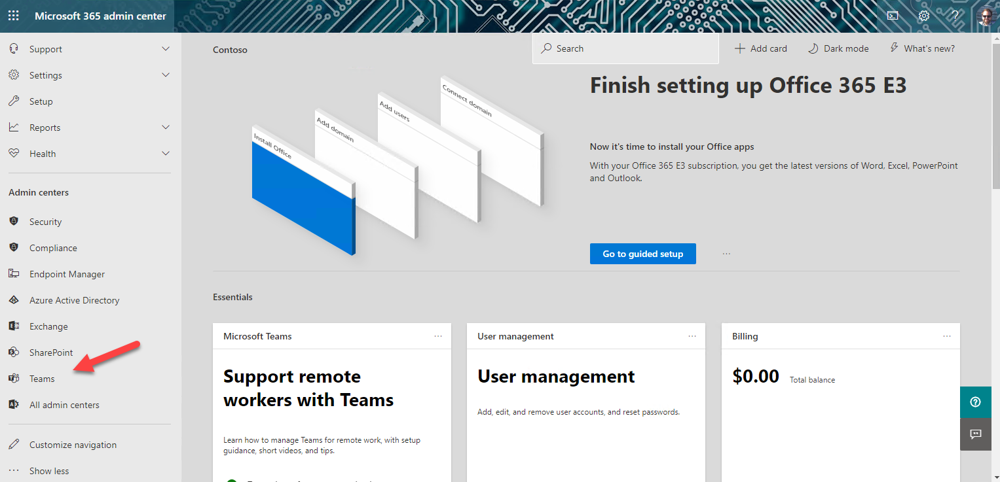

# Welcome to the best Microsoft Teams development lab ever!

At least we hope so! This is, as far as we know, the first and only lab about _extending_ or _migrating_ an existing application to Microsoft Teams, rather than starting from scratch. You will be provided with a simple, working web-based application in the very first lab, and as you go through the labs, you'll extend it into a full-featured Teams application.

For you to succeed from day 1, we'd like you to be well prepared 🚀.
Here are some things you can set up before doing the labs. 

## Your set up

We are not talking about your workplace set up 😁 but about your development device and what you'll need to install in it.
It could be your personal laptop, work laptop or a VM of your choice.

To complete these labs you will need:

- [NodeJS](https://nodejs.org/en/download/) versions 14.17.4 and 16.14.2 tested
- A code editor of your choice, but if you ask us, we really like [Visual Studio Code](https://code.visualstudio.com/download)
- [ngrok](https://ngrok.com/download), which is a tunnelling program that allows you to access your local web server (running in NodeJS in this case) from the Internet. And we'll need this to test teams applications. NOTE: There are work-arounds for using ngrok in most of the labs but it's significantly easier if you use ngrok and the lab instructions all assume you're using it. For details, see [this video](https://www.youtube.com/watch?v=A5U-3o-mHD0).

## Your Microsoft 365 tenant related prerequisites

- Get a (free!) Microsoft 365 tenant

If you don't yet have a tenant, please join the [Microsoft 365 Developer Program](https://developer.microsoft.com/microsoft-365/dev-program?WT.mc_id=m365-58890-cxa) to get a free one. Your tenant includes 25 [E5 user licenses](https://www.microsoft.com/microsoft-365/enterprise/compare-office-365-plans) and can be renewed as long as you keep developing!

Click "Join now" to begin.

Log in with any Microsoft personal or work and school account, enter your information, and click "Next". You will have an opportunity to choose what kind of "sandbox" you want; the "Instant sandbox" is recommended.

Follow the wizard and select your administrator username and password, tenant domain name, etc. The domain name you choose is just the left-most portion - for example if you enter "Contoso" your domain will be "Contoso.onmicrosoft.com".

Remember this information as you'll need it throughout the labs! You will log in as <username>@<domain>.onmicrosoft.com with the password your chose. You'll be prompted for your phone number and then the system will set up your subscription.

Eventually you'll be prompted to log into your new tenant. Be sure to use the new administrator credentials you just created, not the ones you used when you signed up for the developer program.

---
😎 DON'T DEVELOP IN PRODUCTION: It may be tempting to build solutions right where you work every day, but there are good reasons to have a dedicated dev tenant - and probably additional staging/test tenants. They're free, and you can safely experiment as a tenant admin without risking your production work. 

---
😎 NAVIGATING MANY TENANTS: Consider creating a browser profile for each tenant that will have its own favorites, stored credentials, and cookies so you can easily switch between tenants as you work.

---
😎 CHANGES ROLL OUT FIRST TO "TARGETED RELEASE" TENANTS. You may want to [enable Targeted Release](https://docs.microsoft.com/microsoft-365/admin/manage/release-options-in-office-365) in your developer tenant and keep production on Standard Release so you have a head start to test out new features.

---

- Enable Teams application uploads

By default, end users can't upload Teams applications directly; instead an administrator needs to upload them into the enterprise app catalog. In this step you will enable direct uploads to make development easier and allow installation directly from the Teams user interface.

  a. In the left panel of the admin center, click "Show all" to open up the entire navigation

  

  When the panel opens, click Teams to open the Microsoft Teams admin center.

  

  b. In the left of the Microsoft Teams admin center, open the Teams apps accordion 1️⃣ and select Setup Policies 2️⃣. You will see a list of App setup policies. Click the Global (Org-wide default) policy 3️⃣.

  

 c. Ensure the first switch, "Upload custom apps" is turned On. And select **Save** button at the end of this page.

 

 We have been working to get this enabled by default on developer tenants, so it may already be set for you. The change can take up to 24 hours to take effect, but usually it's much faster.

Thanks and enjoy the labs!
