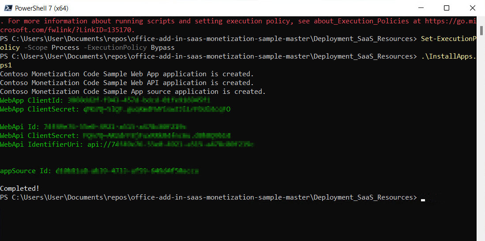
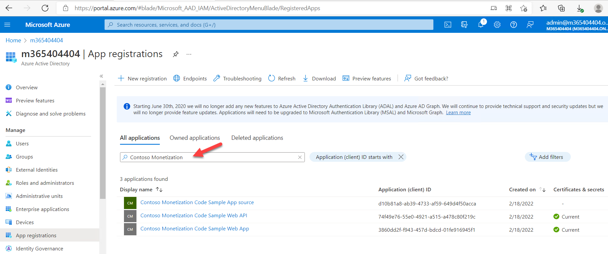

---8<--- "heading.md"

# Deploying the sample App Source Simulator and Licensing service

The lab [Selling your SaaS-based Teams Extension](/app-camp/aad/Monetization) utilizes a sample "App Source" (which stands in for the real App Source or the Teams app store) and a licensing service (which you would write for your own application).

If you wish to install these services yourself, here are the instructions.

??? note "Table of Contents (open to display ►)"
    - [Exercise 1: Download source code for lab](#exercise-1-download-source-code-for-lab)
    - [Exercise 2:  Deploy resources to Azure](#exercise-2--deploy-resources-to-azure)
    - [Step 1: Update ARM parameters file](#step-1-update-arm-parameters-file)
    - [Step 2: Overcoming install errors](#step-2-overcoming-install-errors)
    - [Step 3: Deploy the ARM template with PowerShell](#step-3-deploy-the-arm-template-with-powershell)
    - [Step 4: Deploy the applications to Azure](#step-4-deploy-the-applications-to-azure)
    - [Step 5: Update .env file with deployed resources.](#step-5-update-env-file-with-deployed-resources)
    - [Exercise 3: Set application permissions](#exercise-3-set-application-permissions)
    - [Step 1: Return to the Northwind Orders app registration](#step-1-return-to-the-northwind-orders-app-registration)
    - [Step 2: Add permission to call the licensing application](#step-2-add-permission-to-call-the-licensing-application)
    - [Step 2A (ONLY IF NEEDED): Add permission across tenants](#step-2a-only-if-needed-add-permission-across-tenants)
    - [Step 3: Consent to the permission](#step-3-consent-to-the-permission)
    - [Exercise 4: Northwind Orders calls the licensing service](#exercise-4-northwind-orders-calls-the-licensing-service)
    - [Step 1: Add a server side function to validate the user has a license](#step-1-add-a-server-side-function-to-validate-the-user-has-a-license)
    - [Step 2: Add a server side API to validate the user's license](#step-2-add-a-server-side-api-to-validate-the-users-license)
    - [Step 3: Add client pages to display a license error](#step-3-add-client-pages-to-display-a-license-error)
    - [Step 4: Check if the user has a license](#step-4-check-if-the-user-has-a-license)
    - [Step 5: Call the license API](#step-5-call-the-license-api)
    - [Exercise 5: Run the application](#exercise-5-run-the-application)
    - [Step 1: Run Teams without a license](#step-1-run-teams-without-a-license)
    - [Step 2: "Purchase" a subscription and set licensing policy](#step-2-purchase-a-subscription-and-set-licensing-policy)
    - [Step 3: Run the application in Teams](#step-3-run-the-application-in-teams)

Over the course of these exercises you will complete the following lab goals.

1. Deploy the **AppSource** simulator and sample SaaS fulfillment and licensing service in Microsoft Azure.
2. Observe the interactions between **AppSource** and a **SaaS landing page** in a simulated environment
3. Connect the Northwind Orders application to the sample **SaaS licensing service** to enforce licenses for Microsoft Teams users

## Features added in this lab

- ****AppSource** simulator** enabling a customer can "purchase" a subscription to your application
- **Sample web service** that fulfills this purchase and manages licenses for Microsoft Teams users to use the Northwind Orders application
- **Northwind Orders application** checks to ensure Microsoft Teams users are licensed or displays an error page

## Lab prerequisites

This lab requires the following prerequisites.

1. An active Azure subscription on your own Azure tenant.
2. An active M365 tenant, which can be the one you created in the prerequisites lab.
3. PowerShell 7 (This is cross-platform and will run on MacOS and Linux)
4. .NET Core 3.1 SDK (This is cross-platform and will run on MacOS and Linux)
5. .NET Framework 4.8 Developer Pack

!!! note
    If you want to run or modify these applications locally, you may find it helpful to install [Visual Studio 2022](https://visualstudio.microsoft.com/vs/){target="_blank"} for Windows. The free **Community** edition will work fine. During installation, select the following modules to be added to Visual Studio.

    1. ASP.NET and web development

    2. Azure development

    3. Office/SharePoint development

    4. .NET cross-platform development

### Install the prerequisites

1. Install [PowerShell 7](https://github.com/PowerShell/PowerShell/releases/tag/v7.1.4)
2. Install the following PowerShell modules (You will need an elevated prompt)
    - [Microsoft Graph PowerShell SDK](https://github.com/microsoftgraph/msgraph-sdk-powershell#powershell-gallery) 

      ```powershell
      Install-Module Microsoft.Graph -AllowClobber -Force
      ```

     - [Azure Az PowerShell module](https://docs.microsoft.com/en-us/powershell/azure/install-az-ps?view=azps-6.4.0&WT.mc_id=m365-58890-cxa#installation)

        ```powershell
        Install-Module -Name Az -Scope CurrentUser -Repository PSGallery -AllowClobber -Force
        ```
3. Install [.NET Core 3.1 SDK](https://dotnet.microsoft.com/download/dotnet/3.1)
4. [.NET Framework 4.8 Developer Pack](https://dotnet.microsoft.com/download/dotnet-framework/thank-you/net48-developer-pack-offline-installer)

## Exercise 1: Download source code for lab

To complete this lab you'll deploy the following to Azure. 

- Northwind Web App - The Northwind SaaS application
- License Service Web API - An API that serves as a licensing service
- AppSource Simulator - An application that simulates the AppSource 
- SQL Server and database

You'll create the three applications and their supporting infrastructure using automated deployment scripts called [ARM templates](https://docs.microsoft.com/en-us/azure/azure-resource-manager/templates/overview).

**Download the source code needed for these services**

1. Go to [https://github.com/OfficeDev/office-add-in-saas-monetization-sample](https://github.com/OfficeDev/office-add-in-saas-monetization-sample).
2. Clone or download the project to your local machine.

## Exercise 2:  Deploy resources to Azure

In this exercise you will deploy resources into your Azure subscription using an ARM template. These resources will all share the same resource group. They include the three web applications and a SQL server instance with a database.

### Step 1: Update ARM parameters file

1. In the project you just downloaded in Exercise 1, Step 2, go to folder `office-add-in-saas-monetization-sample/Deployment_SaaS_Resources/` in your text editor.
2. Open the `ARMParameters.json` file and note the following parameters.
    ```text
        - webAppSiteName
        - webApiSiteName
        - resourceMockWebSiteName
        - domainName
        - directoryId (Directory (tenant) ID)
        - sqlAdministratorLogin
        - sqlAdministratorLoginPassword
        - sqlMockDatabaseName
        - sqlSampleDatabaseName
    ```
3. Enter a unique name for each web app and web site in the parameter list shown below because each one must have a unique name across all of Azure.  All of the parameters that correspond to web apps and sites in the following list end in **SiteName**.
   
!!! note
    If you need assistance findinn your **domainName** and **directoryId**, please refer to this [article](https://docs.microsoft.com/en-us/partner-center/find-ids-and-domain-names?WT.mc_id=m365-58890-cxa#find-the-microsoft-azure-ad-tenant-id-and-primary-domain-name).

Based on the subscription you are using, you may change the location where your azure resources are deployed. To change this, find the `DeployTemplate.ps1` file and search for variable `$location`.     By default it is `centralus` but you can change it to a region near you, such as `eastus`.

Leave the rest of the configuration in file `ARMParameters.json` as is, this will be automatically filled in after scripts deploy the resources.

4. In a Powershell 7 window, change to the **./Deployment_SaaS_Resources** directory.

5. Run the following command. You will be prompted to sign in and accept a **Permissions requested** dialog as shown below.

    ```powershell
    Connect-Graph -Scopes "Application.ReadWrite.All, Directory.AccessAsUser.All DelegatedPermissionGrant.ReadWrite.All Directory.ReadWrite.All"
    ```


6. Click **Accept**.

Once accepted, the browser will redirect and show the below message. You can close the browser and continue with the PowerShell command line.

 

7. In the same PowerShell terminal window run `.\InstallApps.ps1`.

!!! note
    This step adds `Microsoft Graph PowerShell` in Azure Active Directory under [Enterprise Applications](https://docs.microsoft.com/en-us/azure/active-directory/manage-apps/add-application-portal) with the necessary permissions so we can create the needed applications for this particular exercise using its commands.
     
!!! warning
    You might get an error as shown below. It depends on the execution policy settings in PowerShell. If you do get the error, **move to [Step 2](#step-2-overcoming-install-errors)**. If you do not get the error **keep going**.

    

8. Copy the values from the output and later you will need  these values to update the code and .`env` file for deploying add-ins. These values will also be pre-populated in `ARMParameters.json`. Do not change this file.
9. Note how the `ARMParameters.json` file is now updated with the values of applications deployed.
10. Since you did not get the PowerShell error, [move to Step 3](#step-3-deploy-the-arm-template-with-powershell).

### Step 2: Overcoming install errors

!!! note
    **This step is only needed if the previous step ended in an error.**

The error you experienced above is likely due to the execution policy of your PowerShell terminal. Here you will set the PowerShell execution policy to be less restrictive and then re-run the install script.

You will set the execution policy to `Bypass` for now. Read more on execution policies [here](https://docs.microsoft.com/en-us/powershell/module/microsoft.powershell.security/set-executionpolicy?view=powershell-7.2&WT.mc_id=m365-58890-cxa){target="_blank"}.

1. Run below PowerShell command.
    ```powershell
    Set-ExecutionPolicy -Scope Process -ExecutionPolicy Bypass
    ```
2. Now re-run `.\InstallApps.ps1`

    The script should now run to create all three applications in Azure AD. At the end of the script, your command line should display below information.:



3. Copy the values from the output and later you will need  these values to update the code and .env file for deploying Add-ins. These values will also be pre-populated in `ARMParameters.json`. Do not change this file.

4. Notice how the `ARMParameters.json` file is now updated with the values of applications deployed.

### Step 3: Deploy the ARM template with PowerShell

1. Open PowerShell 7 and run the Powershell command `Connect-AzAccount`. This will redirect you to login page.
2. Confirm with the Global admin credentials. You will be redirected to a page displaying below.


3. Close the browser and continue with PowerShell. You will see similar output to that shown below in your command line, if everything is okay.


4. Run the script `.\DeployTemplate.ps1`. 
    When prompted, enter the name of the resource group to create.


Your resources will start to get deployed one after the other and you'll see the output as shown below if everything is okay.


You'll get a message on the command line that the ARM Template deployment was successfully as shown below.


5. Go to the `App registrations` in Azure AD in Azure portal. Use this [link](https://portal.azure.com/#blade/Microsoft_AAD_IAM/ActiveDirectoryMenuBlade/RegisteredApps) to navigate to it.

Under **All applications**,  filter with Display name `Contoso Monetization`.
You should see three apps as shown in the screen below:



### Step 4: Deploy the applications to Azure

Here you'll deploy the server side code for the three applications.

1. In the command line, change to the `.\MonetizationCodeSample` directory.
2. Run the script `.\PublishSaaSApps.ps1`.
3. When prompted, enter the same resource group name you chose earlier.
    You will see the source code in your local machine getting built and packaged.


!!! note
    You may see some warnings about file expiration, please ignore.

The final messages may look like the image below.

 

### Step 5: Complete the monetization lab

At this point you should be able to complete the [Selling your SaaS-based Teams Extension](../aad/Monetization.md) lab using these values in the .env file, and granting permission to the application your just registered.

```
SAAS_API=https://(webApiSiteName).azurewebsites.net/api/Subscriptions/CheckOrActivateLicense
SAAS_SCOPES=api://(webApiClientId)/user_impersonation
OFFER_ID=contoso_o365_addin
```

Replace the values &lt;webApiSiteName&gt; and &lt;webApiClientId&gt; with the values from your `ARMParameters.json` file.

Try visiting the **AppSource** simulator, which is at `https://(webAppSiteName).azurewebsites.net`; you should be able to log in using your tenant administrator account. **Don't** purchase a subscription yet, however!

